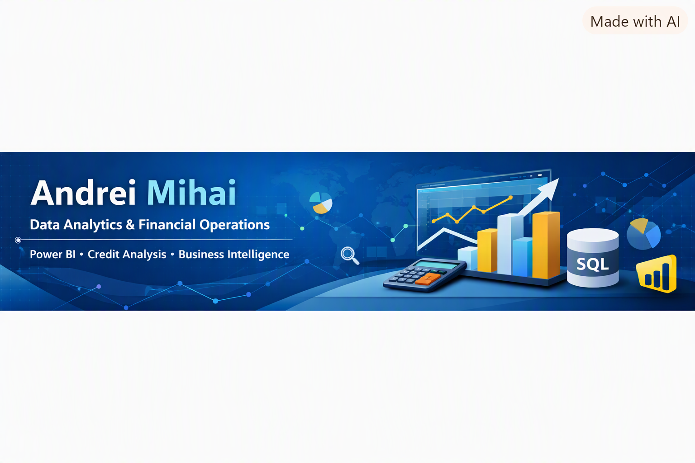

  

# 👋 Hi, I'm Andrei

I am a motivated and detail‑oriented professional with experience in **banking, retail credit (PF), financial operations, customer relations, hospitality, and logistics**, currently transitioning into **Data Analytics**.

My background in **credit analysis, customer lending, financial workflows, and operational processes** helps me approach data with a strong business mindset. I understand how financial decisions are made, how risk is evaluated, and how customer behavior impacts business performance — and I use data to support better decisions.

I combine my professional experience with analytical tools such as **Power BI, Excel, SQL, and Power Query** to build dashboards, automate reporting, and extract meaningful insights.

---

## 🚀 Highlights
- 5+ years of combined experience in banking, customer relations, and operations  
- Strong understanding of retail credit, risk assessment, and financial processes  
- Transitioning into Data Analytics with solid business and financial insight  
- Skilled in Power BI, Excel, SQL, and Power Query  
- Passionate about transforming data into actionable business decisions  

---

## 🎓 Education  
**Bachelor’s Degree in International Business – Stefan cel Mare University of Suceava, Romania**  
Developed a solid foundation in economics, global markets, finance, and business operations.

**High School Diploma – Tourism & Food Services at Colegiul Economic Dimitrie Cantemir, Suceava, Romania**  
Strengthened communication, service management, teamwork, and customer interaction skills.

---

## 💼 Professional Background  

### 🟦 Banking & Financial Services  
Experience in **retail credit**, customer onboarding, financial product presentation, document verification, and operational workflows.  
I have worked directly with clients, assessed needs, explained credit products, and ensured compliance with internal banking procedures.

### 🟦 Customer Relations & Hospitality  
Worked in customer-facing roles in Romania and the United States, developing strong communication skills, empathy, and the ability to handle high‑pressure environments.

### 🟦 Logistics & Operations  
Experience in warehouse operations, inventory handling, and workflow organization — roles that strengthened discipline, accuracy, and process thinking.

---

## 📚 What I'm Learning Now
- Advanced DAX for Power BI  
- SQL fundamentals and query optimization  
- Financial analysis and credit risk modeling  
- Dashboard UX and data storytelling  

---

## 🌐 Connect with Me

---

## 🎓 Certifications
- Microsoft Certified: Power BI Data Analyst (in progress)  
- Google AI Essentials  
- Excel Advanced for Business Analytics  

---

## 🌍 Languages
- Romanian (native)  
- English (professional proficiency)

---

## 🎯 My Goals for 2026
- Become a certified Power BI Data Analyst  
- Build 3–5 complete BI projects  
- Improve SQL to intermediate level  
- Transition into a **Data Analyst / BI Analyst / Financial Analyst** role in the **United States** or **Canada** 
- Contribute to financial analytics and credit risk projects  
- Grow professionally in a company that offers **visa sponsorship**

---

## 🤝 Soft Skills
- Analytical thinking  
- Customer communication  
- Problem-solving  
- Attention to detail  
- Adaptability  
- Teamwork and collaboration  
- Ability to work under pressure  

---

## 🎯 Interests
- Financial analytics  
- Credit risk modeling  
- Business intelligence  
- Data storytelling  
- Process optimization  
- Dashboard UX  
- Customer behavior analysis  

---

## 📊 Technical Skills  
- **Power BI** (Data Modeling, DAX, ETL, Dashboard Design)  
- **Power Query** (data cleaning, transformations, automation)  
- **Excel** (advanced formulas, reporting, data preparation)  
- **SQL** (beginner level, continuously improving)  
- **Data Visualization & Storytelling**  
- **Google AI Essentials**

---

## 🌎 Career Objective  
I am actively pursuing roles in:

- **Data Analytics**
- **Banking**
- **Business Intelligence**  
- **Financial Analysis**  
- **Credit Risk & Lending Analytics**

I am fully open to relocation and seeking opportunities in the **United States** and **Canada** that offer **visa sponsorship**.  
My goal is to combine my financial background with data analytics to support better decision‑making, improve customer insights, and optimize business performance.

---

## 📁 Featured Projects  
### 🔹 Dreamcatcher USA — Power BI Analytics Project  
A complete end‑to‑end BI project built using enterprise standards.  
Includes ETL, data modeling, DAX, dashboards, QA, and business insights.

👉 Available in my repositories.

---

## 🤝 Let’s Connect  
I’m open to collaboration, feedback, and professional opportunities.
